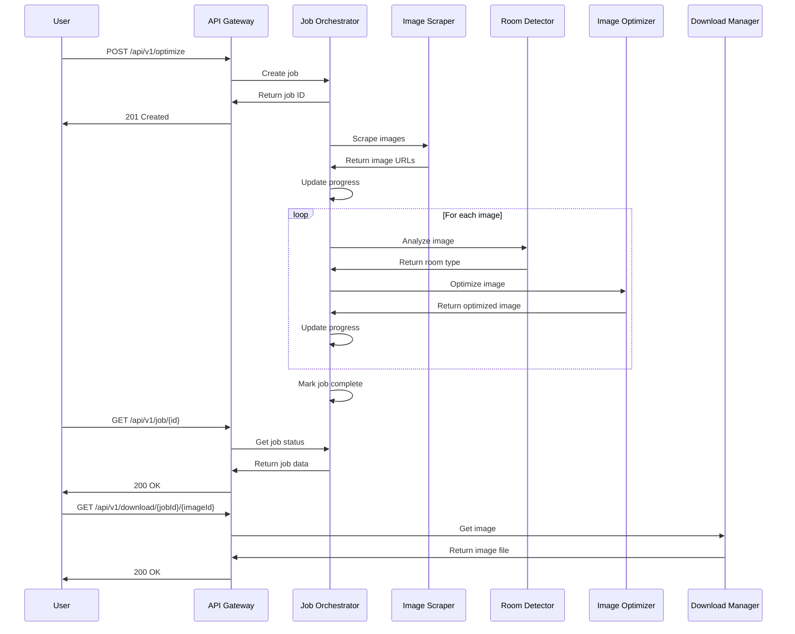
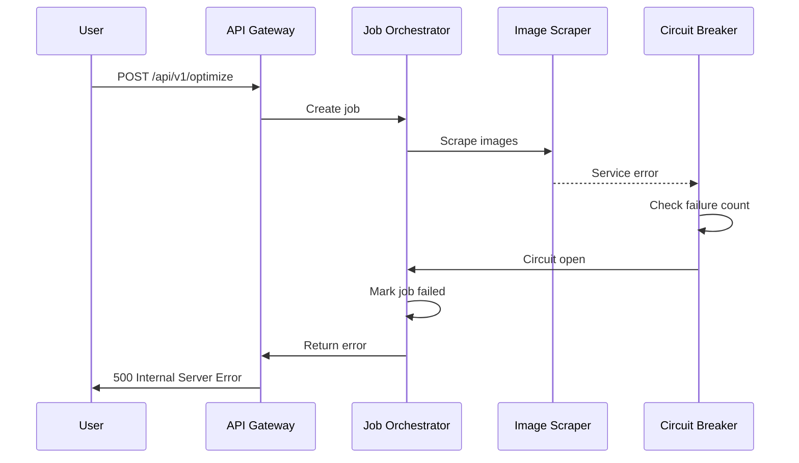

# Architecture Documentation

This document provides comprehensive information about the Airbnb Image Optimizer architecture, design decisions, and system components.

## Table of Contents

- [System Overview](#system-overview)
- [Architecture Patterns](#architecture-patterns)
- [Component Architecture](#component-architecture)
- [Data Flow](#data-flow)
- [Technology Stack](#technology-stack)
- [Deployment Architecture](#deployment-architecture)
- [Security Architecture](#security-architecture)
- [Monitoring & Observability](#monitoring--observability)
- [Scalability Considerations](#scalability-considerations)

## System Overview

The Airbnb Image Optimizer is a cloud-native application that automatically enhances Airbnb listing images using AI-powered room detection and optimization. The system follows a microservices-inspired architecture with clear separation of concerns.

### Core Capabilities

1. **Image Scraping**: Extract images from Airbnb listings using web scraping
2. **Room Detection**: Use AI to identify room types in images
3. **Image Optimization**: Enhance images based on room-specific optimization rules
4. **Batch Processing**: Handle multiple images concurrently with progress tracking
5. **Download Management**: Provide optimized images for download

### Key Requirements

- **Performance**: Process images within 30 seconds
- **Reliability**: 99.9% uptime with graceful error handling
- **Scalability**: Handle 1000+ concurrent requests
- **Security**: Secure API access and data protection
- **Monitoring**: Comprehensive observability and alerting

## Architecture Patterns

### 1. Clean Architecture

The application follows Clean Architecture principles with clear separation of layers:

```
┌─────────────────────────────────────────────────────────────┐
│                    Presentation Layer                       │
│  ┌─────────────┐  ┌─────────────┐  ┌─────────────┐        │
│  │   Web UI    │  │   API REST  │  │   WebSocket │        │
│  └─────────────┘  └─────────────┘  └─────────────┘        │
└─────────────────────────────────────────────────────────────┘
┌─────────────────────────────────────────────────────────────┐
│                   Application Layer                         │
│  ┌─────────────┐  ┌─────────────┐  ┌─────────────┐        │
│  │ Use Cases   │  │   DTOs      │  │  Services   │        │
│  └─────────────┘  └─────────────┘  └─────────────┘        │
└─────────────────────────────────────────────────────────────┘
┌─────────────────────────────────────────────────────────────┐
│                     Domain Layer                            │
│  ┌─────────────┐  ┌─────────────┐  ┌─────────────┐        │
│  │  Entities   │  │  Repos      │  │  Services   │        │
│  └─────────────┘  └─────────────┘  └─────────────┘        │
└─────────────────────────────────────────────────────────────┘
┌─────────────────────────────────────────────────────────────┐
│                 Infrastructure Layer                        │
│  ┌─────────────┐  ┌─────────────┐  ┌─────────────┐        │
│  │  External   │  │   Storage   │  │  Monitoring │        │
│  │  Services   │  │             │  │             │        │
│  └─────────────┘  └─────────────┘  └─────────────┘        │
└─────────────────────────────────────────────────────────────┘
```

### 2. Event-Driven Architecture

The system uses events for loose coupling and scalability:

- **Job Events**: Job status changes, progress updates
- **Image Events**: Processing completion, errors
- **System Events**: Health checks, metrics collection

### 3. Circuit Breaker Pattern

Implements circuit breakers for external service calls:

- **Apify Service**: Web scraping reliability
- **Gemini Service**: AI processing reliability
- **Image Processing**: Optimization reliability

## Component Architecture

### Core Components

#### 1. API Gateway
- **Purpose**: Entry point for all API requests
- **Responsibilities**: Authentication, rate limiting, request routing
- **Technology**: Next.js API Routes with middleware

#### 2. Job Orchestrator
- **Purpose**: Manages optimization job lifecycle
- **Responsibilities**: Job creation, status tracking, progress updates
- **Technology**: Custom service with in-memory storage

#### 3. Image Scraper
- **Purpose**: Extracts images from Airbnb listings
- **Responsibilities**: Web scraping, image URL extraction
- **Technology**: Apify integration

#### 4. Room Detector
- **Purpose**: Identifies room types in images
- **Responsibilities**: AI-powered image analysis
- **Technology**: Google Gemini API

#### 5. Image Optimizer
- **Purpose**: Enhances images based on room type
- **Responsibilities**: AI-powered image enhancement
- **Technology**: Google Gemini API

#### 6. Download Manager
- **Purpose**: Handles image downloads
- **Responsibilities**: File serving, ZIP creation
- **Technology**: Next.js API Routes

### External Services

#### 1. Apify
- **Purpose**: Web scraping service
- **Integration**: REST API with authentication
- **Rate Limits**: 1000 requests/month (free tier)

#### 2. Google Gemini
- **Purpose**: AI image analysis and optimization
- **Integration**: REST API with authentication
- **Rate Limits**: 15 requests/minute

#### 3. Vercel
- **Purpose**: Hosting and deployment
- **Features**: Edge functions, automatic scaling
- **Limits**: 100GB bandwidth/month (free tier)

## Data Flow

### 1. Image Optimization Flow



### 2. Error Handling Flow



## Technology Stack

### Frontend
- **Framework**: Next.js 14 with App Router
- **Styling**: Tailwind CSS
- **State Management**: React hooks
- **Testing**: Jest, React Testing Library, Playwright

### Backend
- **Runtime**: Node.js 18
- **Framework**: Next.js API Routes
- **Language**: TypeScript
- **Validation**: Zod

### External Services
- **Web Scraping**: Apify
- **AI Processing**: Google Gemini
- **Hosting**: Vercel

### Infrastructure
- **Containerization**: Docker
- **Orchestration**: Docker Compose
- **Monitoring**: Prometheus, Grafana
- **Logging**: Loki, Promtail

### Development Tools
- **Package Manager**: npm
- **Linting**: ESLint
- **Formatting**: Prettier
- **Testing**: Jest, Playwright
- **CI/CD**: GitHub Actions

## Deployment Architecture

### Production Environment

```
┌─────────────────────────────────────────────────────────────┐
│                        Internet                             │
└─────────────────────┬───────────────────────────────────────┘
                      │
┌─────────────────────▼───────────────────────────────────────┐
│                    Vercel Edge                              │
│  ┌─────────────┐  ┌─────────────┐  ┌─────────────┐        │
│  │   CDN       │  │   Edge      │  │   Analytics │        │
│  │             │  │  Functions  │  │             │        │
│  └─────────────┘  └─────────────┘  └─────────────┘        │
└─────────────────────┬───────────────────────────────────────┘
                      │
┌─────────────────────▼───────────────────────────────────────┐
│                  Application Layer                          │
│  ┌─────────────┐  ┌─────────────┐  ┌─────────────┐        │
│  │   Next.js   │  │   API       │  │   Static    │        │
│  │   App       │  │  Routes     │  │   Assets    │        │
│  └─────────────┘  └─────────────┘  └─────────────┘        │
└─────────────────────┬───────────────────────────────────────┘
                      │
┌─────────────────────▼───────────────────────────────────────┐
│                External Services                            │
│  ┌─────────────┐  ┌─────────────┐  ┌─────────────┐        │
│  │    Apify    │  │   Gemini    │  │   Sentry    │        │
│  │             │  │             │  │             │        │
│  └─────────────┘  └─────────────┘  └─────────────┘        │
└─────────────────────────────────────────────────────────────┘
```

### Development Environment

```
┌─────────────────────────────────────────────────────────────┐
│                Docker Compose Stack                        │
│  ┌─────────────┐  ┌─────────────┐  ┌─────────────┐        │
│  │    App      │  │   Redis     │  │  Postgres   │        │
│  │  (Dev)      │  │             │  │             │        │
│  └─────────────┘  └─────────────┘  └─────────────┘        │
│  ┌─────────────┐  ┌─────────────┐  ┌─────────────┐        │
│  │  Prometheus │  │   Grafana   │  │    Loki     │        │
│  │             │  │             │  │             │        │
│  └─────────────┘  └─────────────┘  └─────────────┘        │
└─────────────────────────────────────────────────────────────┘
```

## Security Architecture

### 1. Authentication & Authorization
- **API Keys**: Required for all API access
- **Rate Limiting**: Per-IP and per-API-key limits
- **Input Validation**: Comprehensive request validation

### 2. Data Protection
- **Encryption**: HTTPS for all communications
- **Secrets Management**: Environment variable validation
- **Data Minimization**: Only necessary data is stored

### 3. Security Headers
- **CSP**: Content Security Policy
- **HSTS**: HTTP Strict Transport Security
- **X-Frame-Options**: Clickjacking protection
- **X-Content-Type-Options**: MIME type sniffing protection

### 4. Error Handling
- **Secure Errors**: No sensitive information in error messages
- **Logging**: Comprehensive security event logging
- **Monitoring**: Real-time security monitoring

## Monitoring & Observability

### 1. Metrics
- **Application Metrics**: Request count, response time, error rate
- **Business Metrics**: Job completion rate, image processing time
- **System Metrics**: CPU, memory, disk usage

### 2. Logging
- **Structured Logging**: JSON format with consistent fields
- **Log Levels**: Error, warn, info, debug
- **Log Aggregation**: Centralized log collection and analysis

### 3. Tracing
- **Distributed Tracing**: Request flow across services
- **Performance Tracing**: Detailed timing information
- **Error Tracing**: Error propagation and context

### 4. Alerting
- **Health Checks**: Automated health monitoring
- **Threshold Alerts**: Performance and error rate alerts
- **Incident Response**: Automated incident escalation

## Scalability Considerations

### 1. Horizontal Scaling
- **Stateless Design**: No server-side session storage
- **Load Balancing**: Vercel automatic load balancing
- **Database Scaling**: Future database sharding strategy

### 2. Vertical Scaling
- **Resource Optimization**: Efficient memory and CPU usage
- **Caching**: Redis for frequently accessed data
- **CDN**: Global content delivery for static assets

### 3. Performance Optimization
- **Image Optimization**: Lazy loading and compression
- **API Optimization**: Response caching and compression
- **Bundle Optimization**: Code splitting and tree shaking

### 4. Future Enhancements
- **Microservices**: Break down into smaller services
- **Event Streaming**: Apache Kafka for event processing
- **Database**: PostgreSQL for persistent storage
- **Queue System**: Redis Queue for job processing

## Architecture Decision Records (ADRs)

See the [ADRs directory](./adrs/) for detailed architecture decisions:

- [ADR-001: Technology Stack Selection](./adrs/001-technology-stack.md)
- [ADR-002: Clean Architecture Implementation](./adrs/002-clean-architecture.md)
- [ADR-003: External Service Integration](./adrs/003-external-services.md)
- [ADR-004: Error Handling Strategy](./adrs/004-error-handling.md)
- [ADR-005: Monitoring and Observability](./adrs/005-monitoring.md)

## Conclusion

The Airbnb Image Optimizer architecture is designed for scalability, reliability, and maintainability. The clean architecture approach ensures separation of concerns, while the event-driven patterns enable loose coupling and future extensibility. The comprehensive monitoring and observability stack provides visibility into system health and performance.

The architecture supports the current requirements while providing a foundation for future enhancements such as microservices migration, advanced caching strategies, and machine learning model improvements.
